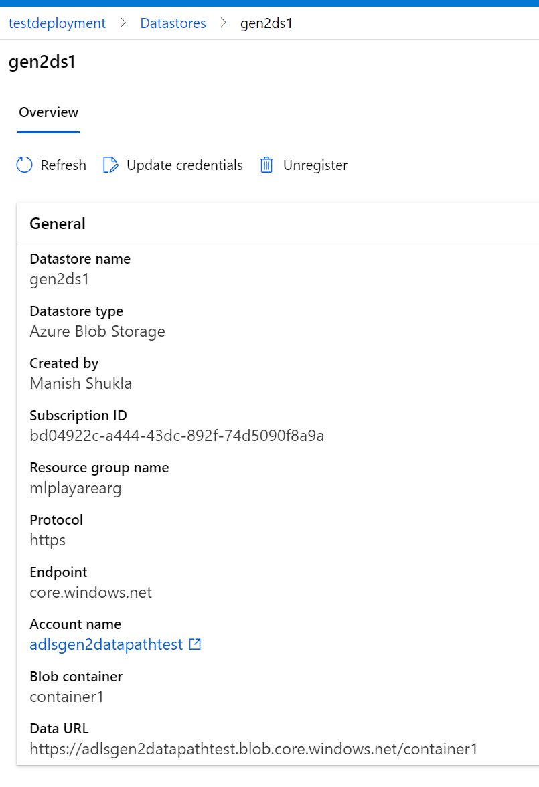
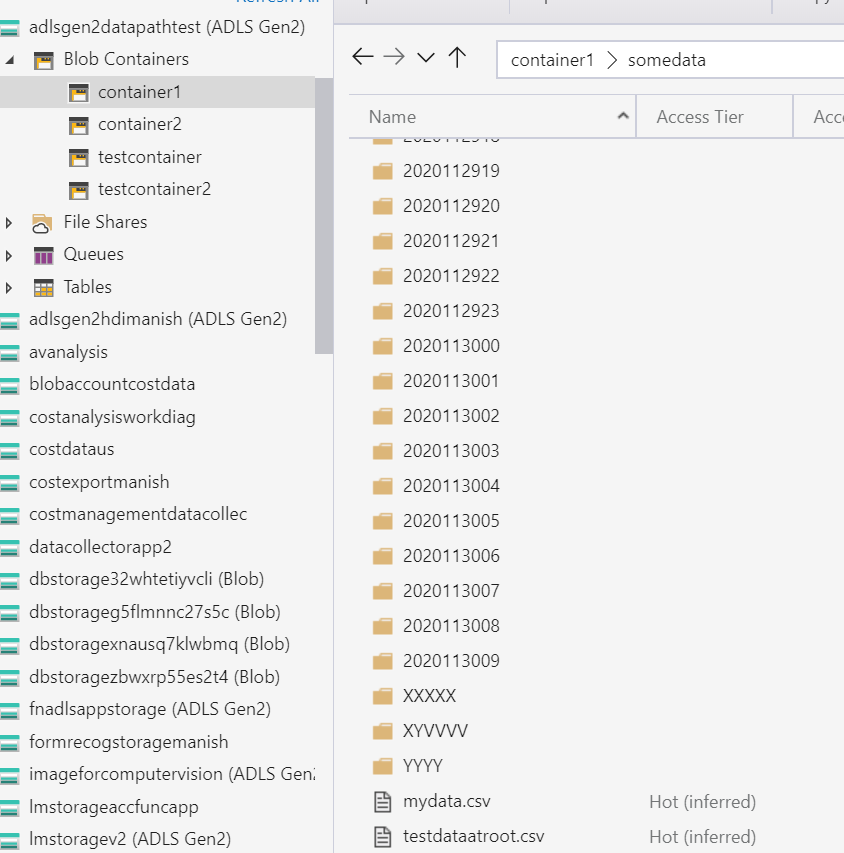
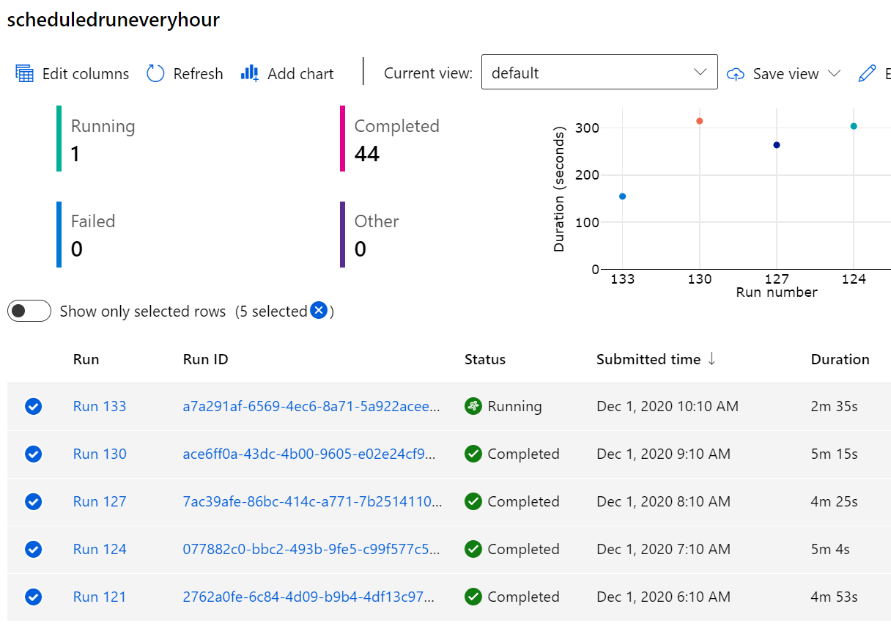
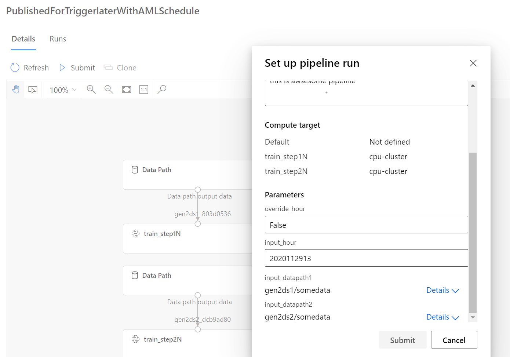
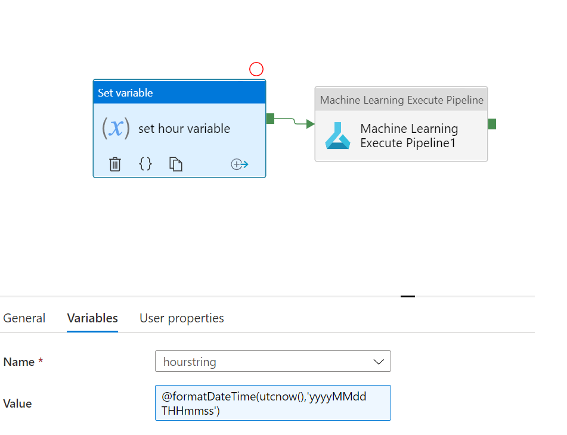
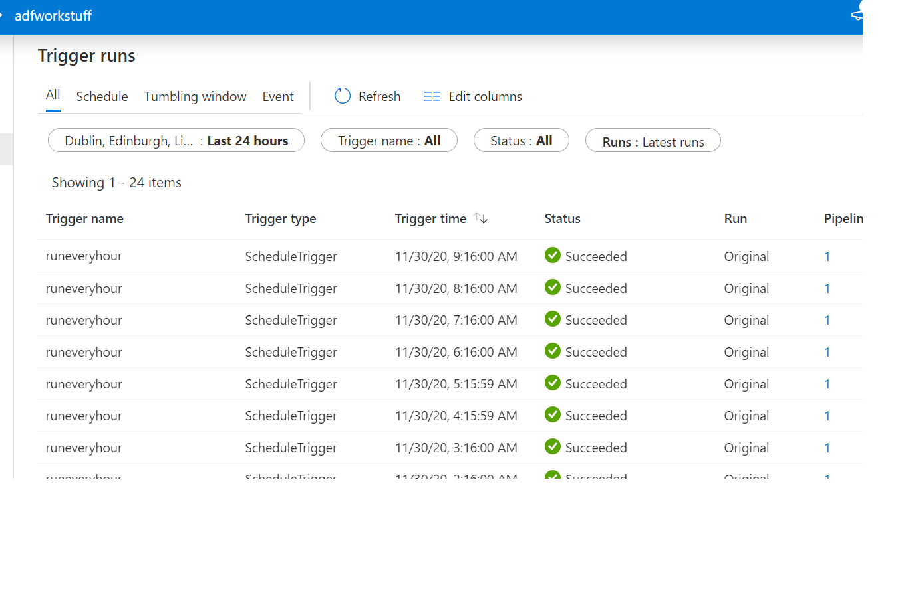

# Run python scripts as different steps in AML pipeline and schedule the AML pipeline (from ADF or AML itself)

Notebooks in this repo shows how we can use AML to run python scripts and pass the data path (some folder location in blob storage) and any other variable.

## Data Store set up in AML:

This sample uses adls gen2 but it is registered as blob storage to be used as mounted data path. Below screenshot shows in aml workspace on how it shows up:

For demonstration purposes there are two datapaths set up. They can be completely different storage accounts on completely different subscription. All the code accessig cares is that they are registered in AML with proper credentials.

## Files exptected by the python scripts

This POC shows how you can read the data from blob storage so it assumes that datastore will have the 2 csvs that it it reading present (mydata and testdataroot csv files). Rest all files are written by scheduled pipelines:

## Notebooks

Notebook using AML scheduling:

1. [Schedules using AML](./notebooks/2stepsAndScheduled.ipynb)

This notebook creates a pipeline and publishes it to AML. Then it also schedules the pipeline to run every hour using AML. The pipline creates folder for every hour within storage location and dumps some test data. You can also re-run same hour again by just manually publishing the pipline from AML studio.

### View on AML side of all scheduled runs:

### Manually trigger pipeline in AML:

1. [Scheduled using ADF](./notebooks/2stepswithdifferentdatapathparams.ipynb)

This notebook creates a pipeline and publishes it to AML. Then it also schedules the pipeline to run every hour using Azure data factory. The pipline creates folder for every hour within storage location and dumps some test data. You can also re-run same hour again by just manually running the pipline from AML studio.

### Trigger from ADF

You can use ML Execute task in AML to just configure any AML pipeline like the screenshot below:

Also you get some monitoring on the run itself on ADF side. This monitoring is in addition to the monitoring you will get on AML side which will have detailed logs of each step of pipeline in AML. This is a great option if AML pipeline has some other dependencies outside of AML.

Below screenshot shows the monitoring view of AML from ADF side. (in addition to what is available in AML)

